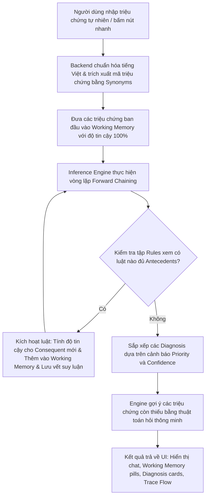

# MedExpert Chatbot: Hệ Chuyên Gia Hỗ Trợ Chẩn Đoán Y Tế Sinh Luật (Rule-Based Expert System)

Ứng dụng web demo mô phỏng một **Hệ chuyên gia hỗ trợ chẩn đoán y tế dựa trên luật (Rule-Based Expert System)** phục vụ học tập môn học **Nhập môn Trí tuệ nhân tạo (IT3160 - HUST)**. Dự án kết hợp bộ suy diễn logic mệnh đề viết bằng Python ở backend và giao diện tương tác hiện đại ở frontend.

---

## 🌟 Các Thành Phần Cốt Lõi Của Hệ Chuyên Gia

Hệ thống được thiết kế và mô phỏng chuẩn xác theo kiến trúc của một hệ chuyên gia truyền thống:

1. **Cơ sở tri thức (Knowledge Base - KB):**
   * Được lưu trữ dưới dạng cấu trúc trong file [knowledge_base.json](file:///d:/T%C3%80I%20LI%E1%BB%86U%20M%C3%94N%20H%E1%BB%8CC%20HUST/Ky%202025.2/Nhap%20mon%20tri%20tue%20nhan%20tao/IT3160%20Project%20-%20Copy%20%282%29/medical_expert/knowledge_base.json).
   * **Sự kiện (`FACTS`):** Gồm triệu chứng (`symptom`), sự kiện dẫn xuất (`derived`), và kết luận chẩn đoán (`diagnosis`).
   * **Luật (`RULES`):** Định dạng luật Horn `IF antecedents THEN consequent` có gắn trọng số độ tin cậy (`confidence`) và giải thích y tế (`explanation`).
   * **Siêu dữ liệu chẩn đoán (`DIAGNOSIS_METADATA`):** Chứa mức độ ưu tiên cảnh báo (`priority`: high, medium, low) và lời khuyên y học (`advice`).

2. **Bộ nhớ làm việc (Working Memory):**
   * Lưu trữ trạng thái hiện tại của phiên hội thoại bao gồm: Các triệu chứng do người dùng cung cấp và các sự kiện được suy diễn ra trong quá trình chạy, kèm theo độ tin cậy được cập nhật liên tục.

3. **Động cơ suy diễn (Inference Engine):**
   * Triển khai giải thuật **Suy diễn tiến (Forward Chaining)** tại [inference_engine.py](file:///d:/T%C3%80I%20LI%E1%BB%86U%20M%C3%94N%20H%E1%BB%8CC%20HUST/Ky%202025.2/Nhap%20mon%20tri%20tue%20nhan%20tao/IT3160%20Project%20-%20Copy%20%282%29/medical_expert/inference_engine.py). Duyệt qua tập luật để sinh ra tri thức mới cho tới khi đạt trạng thái hội tụ (không sinh thêm được sự kiện mới).

4. **Giao diện người dùng (User Interface):**
   * Giao diện web single-page chia thành 2 tab chính: **Tư vấn chẩn đoán** và **Quản lý tri thức**, được tối ưu hóa trải nghiệm người dùng với CSS hiện đại, trực quan hóa dữ liệu động.

---

## 🚀 Các Tính Năng Nổi Bật Được Tinh Chỉnh

* **Tính toán độ tin cậy (Confidence Propagation):**
  * Áp dụng công thức lan truyền độ tin cậy khi kích hoạt luật:
  Áp dụng công thức lan truyền độ tin cậy khi kích hoạt luật:

    $$
  \text{confidence}_{\text{derived}}
  =
  \min(\text{confidence}_{\text{antecedents}})
  \times
  \frac{\text{confidence}_{\text{rule}}}{100}
  $$
  * Giúp hệ thống không chỉ đưa ra kết luận nhị phân đúng/sai mà còn định lượng được mức độ tin cậy của từng chẩn đoán.
* **Giải thích vết suy diễn (Explanation Mechanism):**
  * Hiển thị trực quan luồng suy luận (Trace Flow) dạng cây liên kết các luật đã kích hoạt từ triệu chứng ban đầu đến kết luận bệnh lý cuối cùng.
  * Giải thích chi tiết cơ sở khoa học y tế đằng sau mỗi bước suy luận để tăng tính minh bạch của hệ chuyên gia (hộp đen logic được mở ra rõ ràng).
* **Gợi ý câu hỏi thông minh (Smart Question Selection):**
  * Sử dụng nguyên lý **Suy diễn lùi (Backward Chaining)** để quét ngược từ các bệnh lý có độ ưu tiên cao hoặc các luật gần thỏa mãn để tìm ra các triệu chứng còn thiếu (`suggest_next_facts`).
  * Đưa ra câu hỏi định hướng cho người dùng ("Bạn có thêm các dấu hiệu sau không...?") để thu thập thêm dữ kiện, giúp nâng cao độ chính xác của chẩn đoán.
* **Nhận diện ngôn ngữ tự nhiên cơ bản (NLP Parsing):**
  * Sử dụng cơ chế normalize tiếng Việt (xóa dấu, chuẩn hóa chữ thường) và đối khớp từ đồng nghĩa (`synonyms`) được cấu hình sẵn trong KB. Người dùng có thể chat câu tự nhiên ("tôi bị sot, ho khan va dau hong"), hệ thống tự động trích xuất chính xác các mã triệu chứng tương ứng.
* **Trang quản trị tri thức (Knowledge Base Editor) toàn diện:**
  * Cho phép người dùng trực tiếp Thêm, Sửa, Xóa các **Luật** và **Sự kiện** ngay trên giao diện web mà không cần can thiệp vào mã nguồn.
  * Tích hợp cơ chế kiểm tra tính nhất quán (Validation) chặt chẽ ở backend: Phát hiện trùng lặp khóa, kiểm tra các sự kiện chưa định nghĩa, ngăn chặn xóa sự kiện đang được sử dụng trong các luật khác.
  * Cơ chế nạp nóng (Hot-reload) ghi trực tiếp vào JSON và đồng bộ ngay lập tức vào bộ nhớ của Python server đang chạy mà không cần khởi động lại.

---

## 📁 Cấu Trúc Thư Mục Dự Án

```text
├── medical_expert/
│   ├── __init__.py
│   ├── knowledge_base.json      # Cơ sở dữ liệu tri thức (Facts, Rules, Metadata)
│   ├── knowledge_base.py        # Module quản lý việc đọc/ghi và hot-reload KB
│   ├── inference_engine.py      # Động cơ suy diễn tiến, tính độ tin cậy và giải thích vết
│   └── service.py               # Xử lý hội thoại, trích xuất triệu chứng tự nhiên và tích hợp engine
├── src/
│   └── app.js                   # Logic giao diện frontend (gọi API, render chat, render trace, quản lý tab)
├── index.html                   # Khung giao diện HTML5 của ứng dụng
├── styles.css                   # Định dạng giao diện hiện đại (glassmorphism, color palette sang trọng)
├── app.py                       # HTTP server Python thuần túy, cung cấp các endpoint API RESTful
└── README.md                    # Tài liệu hướng dẫn dự án (file này)
```

---

## 🛠️ Hướng Dẫn Cài Đặt và Khởi Chạy

Dự án chỉ sử dụng các thư viện chuẩn của Python (`standard libraries`) để đảm bảo tính gọn nhẹ, không yêu cầu cài đặt thêm thư viện ngoài (như Flask hay FastAPI).

### Bước 1: Khởi động backend Python
Mở terminal tại thư mục gốc của dự án và chạy lệnh:
```powershell
python app.py
```
Hệ thống sẽ khởi chạy HTTP Server đa luồng tại địa chỉ `http://127.0.0.1:8000`.

### Bước 2: Truy cập ứng dụng
Mở trình duyệt web và truy cập địa chỉ:
```text
http://127.0.0.1:8000
```
> [!IMPORTANT]  
> Hãy chắc chắn truy cập qua địa chỉ `http://127.0.0.1:8000` thay vì mở trực tiếp file `index.html` trong trình duyệt để tránh lỗi chặn CORS khi gọi API.

---

## 🧪 Quy Trình Hoạt Động Chi Tiết



---

## 📖 Ví Dụ Biểu Diễn Tri Thức

### 1. Cách định nghĩa Luật (Rules) trong JSON:
```json
{
    "id": "R15",
    "antecedents": [
        "respiratory_syndrome",
        "loss_of_taste"
    ],
    "consequent": "covid19_suspected",
    "explanation": "Triệu chứng hô hấp cùng mất vị giác hoặc khứu giác gợi ý nhiễm COVID-19.",
    "confidence": 88.0
}
```

### 2. Cách định nghĩa Sự kiện (Facts) trong JSON:
```json
{
    "loss_of_taste": {
        "label": "Mất vị giác/khứu giác",
        "category": "symptom",
        "synonyms": [
            "mat vi giac",
            "mất vị giác",
            "mat khu giac",
            "mất khứu giác",
            "loss of taste"
        ]
    }
}
```

---

## ⚠️ Lưu Ý Học Thuật

Hệ chuyên gia này được xây dựng trên nền tảng cơ sở tri thức y học thu gọn phục vụ cho mục đích nghiên cứu học thuật về **Hệ thống dựa trên luật (Rule-Based Systems)** và **Cơ chế suy diễn logic**. Các chẩn đoán và lời khuyên do chatbot đưa ra hoàn toàn mang tính chất tham khảo và mô phỏng minh họa học tập, **không có giá trị thay thế cho chẩn đoán y khoa chuyên nghiệp từ bác sĩ**.

---

## Các thành viên của dự án

1: Đỗ Quốc Huy - 202416227

2: Vũ Trung Kiên - 202416254

3: Trần Đăng Khoa - 202416247

4: Hồ Đình Ánh - 202416127
